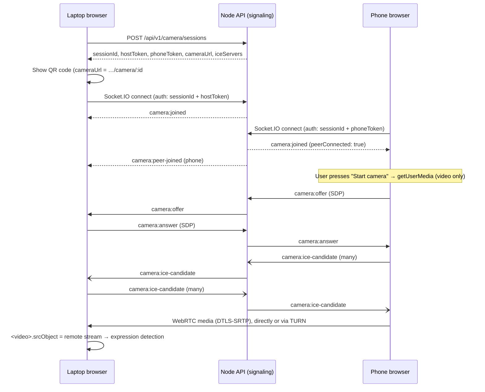

# Phone camera over WebRTC

Use a phone as the camera for the laptop's expression detector. The phone streams live video
**directly to the laptop's browser** over WebRTC. The Node API only helps the two browsers find
each other (signaling). It never receives, stores or relays video.

```text
📱 Phone (/camera/:id)  ──── WebRTC media (encrypted, peer-to-peer) ────►  💻 Laptop (/)
        │                                                                      │
        └──── Socket.IO: offer / answer / ICE ──► Node API ◄──── Socket.IO ────┘
                                                                               ▼
                                                             existing <video> → detector → 😊
```

Related decision record: [ADR 0016](decisions/0016-phone-camera-webrtc.md).

---

## 1. Architecture

| Piece                | Where                                                              | Role                                                                            |
| -------------------- | ------------------------------------------------------------------ | ------------------------------------------------------------------------------- |
| Pairing session      | `POST /api/v1/camera/sessions`                                     | Issues a session id + two **signed** tokens (laptop "host", phone), 10 min TTL  |
| Signaling server     | `server/src/realtime/cameraSignaling.ts` (Socket.IO, `/socket.io`) | Authenticates both peers, relays offer/answer/ICE in the allowed direction only |
| Live presence        | `server/src/realtime/cameraSessionRegistry.ts`                     | In-memory `Map`: at most one laptop + one phone per session                     |
| ICE servers          | `server/src/config/rtc.ts`                                         | STUN/TURN from env, handed to browsers per session (TURN secrets never in JS)   |
| WebRTC (both roles)  | `client/src/services/peerLink.ts` + `hooks/useWebRTC.ts`           | One implementation: phone offers its camera track, laptop answers               |
| Signaling client     | `client/src/services/signaling.ts` + `hooks/useSignaling.ts`       | Socket.IO connection, presence, typed errors                                    |
| Laptop orchestration | `hooks/useCameraSession.ts`, `hooks/usePhoneCamera.ts`             | Session → QR → signaling → WebRTC → one status                                  |
| Laptop UI            | `CameraSourceSelector`, `PhoneCameraConnector`, `QRCodeDisplay`    | "This device / Phone camera", QR code + link, status, remote video              |
| Phone page           | `pages/PhoneCamera/PhoneCameraPage.tsx`                            | Reuses `useCamera` (front/rear switching, errors) and the camera components     |

### One detector for every source

The home page owns a single `<video>` element. The local camera and the phone's remote stream
are both attached to it (`CameraView`), and `useExpressionDetection` only ever reads that element.
The detector does not know or care whether frames come from a webcam, a USB camera, OBS or a
phone. A phone connection is translated into the local camera's status vocabulary
(`utils/cameraSource.ts`), so the existing UI states, smoothing, auto-save and session summary all
work unchanged. The inference loop is the existing throttled loop (5–15 analyses/s, one at a
time, paused when the tab is hidden); it does not run at the camera's frame rate.

### Why signed tokens + an in-memory map (and not just a map)

The API runs as several instances behind Nginx (2 in Docker Compose, 3 in production). A session
stored only in one instance's memory would be unknown to the others. So:

- **Tokens are signed** (HS256, a key derived from `JWT_ACCESS_SECRET` for this purpose only), so
  any instance can check session id, role and expiry without a shared store.
- **Nginx routes `/socket.io/` by hashing the `sessionId` query parameter**, so the laptop and phone
  of a session always reach the **same** instance. That instance keeps live presence in memory.

### Sequence



Only the phone makes offers (it owns the camera track) and only the laptop answers, and the server
enforces that direction. Switching front ↔ rear on the phone uses `RTCRtpSender.replaceTrack`, so
the laptop's video never drops and no renegotiation is needed.

---

## 2. Local setup

```bash
npm install
npm run setup:env   # once: creates .env
```

### Same Wi-Fi, from your phone (development)

Phones only allow camera access in a **secure context**. `http://localhost` qualifies, but a
phone cannot open your laptop's localhost, and `http://192.168.x.x` is **not** a secure context. So
the dev server must use HTTPS on the LAN:

```bash
npm run dev:phone
```

This starts the API and Vite with a self-signed certificate on all interfaces (`--mode phone`).
Vite prints the addresses, e.g. `https://192.168.1.100:5173/`.

1. On the **laptop**, open `https://localhost:5173` (accept the certificate warning once).
2. Click **Camera source → Phone camera**. A QR code appears. In development its link uses the
   laptop's **LAN IP** automatically (never `localhost`; Wi-Fi addresses win over Docker/WSL/Hyper-V
   adapters).
3. Scan the QR code with the phone (same Wi-Fi). Accept the certificate warning on the phone.
4. The phone shows **Connected to laptop**. Press **Start camera** and allow camera access.
5. The laptop shows the phone's video and the detected expression.

If the phone cannot reach the laptop, allow Node through the laptop's firewall for private
networks (Windows prompts the first time) and check both devices are on the same network (guest
Wi-Fi often isolates devices).

`npm run dev` (plain HTTP) still works for everything else, and for trying the phone page in a
second tab on the laptop itself.

### Commands

| Task                          | Command                                                                |
| ----------------------------- | ---------------------------------------------------------------------- |
| Install                       | `npm install`                                                          |
| Development (laptop only)     | `npm run dev` → http://localhost:5173                                  |
| Development (with a phone)    | `npm run dev:phone` → https://localhost:5173 and https://<LAN-IP>:5173 |
| Production build              | `npm run build`                                                        |
| Docker build                  | `docker compose build`                                                 |
| Docker run (local)            | `docker compose up --build` → http://localhost:8080                    |
| Docker run (production-style) | `npm run setup:prod && npm run docker:prod:up` → https://localhost     |
| Tests                         | `npm test` · `npm run test:e2e` (includes a real WebRTC test)          |

---

## 3. Environment variables

All are **server-side** (in `.env`, or passed by Docker Compose). None of them is bundled into the
browser JavaScript.

| Variable                            | Default                        | Purpose                                                                                                |
| ----------------------------------- | ------------------------------ | ------------------------------------------------------------------------------------------------------ |
| `CAMERA_SESSION_TTL_SECONDS`        | `600`                          | How long a QR code/link can be used to join (60–3600)                                                  |
| `PHONE_CAMERA_URL`                  | (empty)                        | Base URL in the QR code. Empty → dev: the laptop page's origin with localhost→LAN IP; prod: `APP_URL`  |
| `STUN_SERVER`                       | `stun:stun.l.google.com:19302` | Comma-separated STUN URLs. Empty = none (same-network connections still work)                          |
| `TURN_SERVER`                       | (empty)                        | Comma-separated TURN URLs, e.g. `turn:turn.example.com:3478?transport=udp,turns:turn.example.com:5349` |
| `TURN_USERNAME` / `TURN_CREDENTIAL` | (empty)                        | Static TURN credentials                                                                                |
| `TURN_SHARED_SECRET`                | (empty)                        | **Recommended**: coturn `use-auth-secret`; the API issues 12-hour credentials per session              |
| `CAMERA_SESSION_RATE_LIMIT_MAX`     | `30`                           | Pairing sessions per IP per 15 minutes                                                                 |

Setting `TURN_SERVER` without credentials makes the API refuse to start (invalid configuration).

> **Why not `VITE_TURN_*`?** Anything prefixed `VITE_` is compiled into the public JavaScript
> bundle, so a TURN password there could be read by anyone and your relay (and its bandwidth
> bill) used by anyone. Serving ICE servers from the API keeps credentials server-side, lets them be
> time-limited, and lets them change without rebuilding the frontend. For the same reason there is
> no `VITE_API_URL`/`VITE_SOCKET_URL`: the browser always talks to its own origin (Vite in
> development, Nginx in Docker/production proxy `/api` and `/socket.io`), which is what makes the
> same build work from a phone on the LAN and over `wss://` in production.

---

## 4. The API and events

### `POST /api/v1/camera/sessions`

No body. Rate-limited (`CAMERA_SESSION_RATE_LIMIT_MAX` per IP per 15 min). Anonymous users may
create sessions (the app works without an account).

```json
{
  "success": true,
  "data": {
    "sessionId": "8DuiXgBs5ywP",
    "hostToken": "eyJ…",
    "phoneToken": "eyJ…",
    "cameraUrl": "https://192.168.1.100:5173/camera/8DuiXgBs5ywP#token=eyJ…",
    "expiresAt": "2026-09-26T10:10:00.000Z",
    "iceServers": [{ "urls": ["stun:stun.l.google.com:19302"] }]
  }
}
```

- `hostToken` stays on the laptop (kept in `sessionStorage` so a refreshed laptop tab rejoins the same
  session). `phoneToken` is only in the QR code/link. It lets the holder join **as the phone**, never
  as the laptop.
- The token is in the URL **fragment** (`#token=`), which browsers never send to servers, so it never
  appears in Nginx/Vite access logs or `Referer` headers.

### Socket.IO (`path: /socket.io`)

Connect with `query: { sessionId }` (for Nginx routing; not secret) and
`auth: { sessionId, token }` (the handshake body, not the URL). Invalid handshakes fail with
`connect_error`, whose `message` is the code below (and `data: { code, message }`). Socket.IO does not
retry after such a rejection.

| Direction       | Event                  | Payload                                          | Who may send | Meaning                                         |
| --------------- | ---------------------- | ------------------------------------------------ | ------------ | ----------------------------------------------- |
| server → client | `camera:joined`        | `{ role, peerConnected, iceServers, expiresAt }` |              | Handshake accepted                              |
| server → client | `camera:peer-joined`   | `{ role }`                                       |              | The other side connected (or reconnected)       |
| server → client | `camera:peer-left`     | `{ role }`                                       |              | The other side disconnected                     |
| both ways       | `camera:offer`         | `{ sdp }` (≤ 20 KB)                              | phone        | WebRTC offer                                    |
| both ways       | `camera:answer`        | `{ sdp }`                                        | laptop       | WebRTC answer                                   |
| both ways       | `camera:ice-candidate` | `{ candidate: RTCIceCandidateInit }`             | both         | Network path candidate                          |
| client → server | `camera:hangup`        | none                                             | phone        | Phone stopped streaming (session stays open)    |
| client → server | `camera:end-session`   | none                                             | laptop       | Session closed for good; the link stops working |
| server → client | `camera:session-ended` | none                                             |              | Sent to the phone after `end-session`           |
| server → client | `camera:error`         | `{ code, message }`                              |              | See codes                                       |

Error codes: `SESSION_INVALID`, `SESSION_EXPIRED`, `SESSION_ENDED`, `REPLACED` (the same role
connected from another tab/device, e.g. after a refresh; newest wins), `INVALID_MESSAGE` (bad payload
or wrong direction), `RATE_LIMITED` (more than 200 messages in 10 s).

Payloads are validated with Zod (strict objects, size limits). The session and role come from the
verified token, never from message payloads. Messages go only to the other peer of the same session.

---

## 5. How WebRTC works (simply)

1. **Offer/answer (SDP).** The phone describes what it wants to send ("one video track, these codecs").
   The laptop replies with what it accepts. These descriptions are small text messages passed through
   the signaling server.
2. **ICE candidates.** Each browser lists the addresses it might be reachable at: local Wi-Fi IP
   (_host_), its public address as seen by a STUN server (_srflx_), or a relay address on a TURN server
   (_relay_). They exchange these lists and test pairs until one works.
3. **Media.** Video then flows over the chosen path, encrypted with DTLS-SRTP. On the same Wi-Fi this
   is usually a direct local connection that never leaves your network.

### STUN vs TURN

- **STUN** only tells a browser its public address. Enough on the same Wi-Fi (even no STUN works
  there) and for many home networks.
- **TURN** relays the media when a direct path is impossible: different networks behind strict
  NATs, mobile data behind carrier-grade NAT, corporate firewalls. **Plan on TURN for production.**
  It carries the (still end-to-end encrypted) video, so it needs bandwidth.

Example coturn (`turnserver.conf`) using short-lived credentials:

```conf
listening-port=3478
tls-listening-port=5349
realm=turn.example.com
use-auth-secret
static-auth-secret=<same value as TURN_SHARED_SECRET>
cert=/etc/letsencrypt/live/turn.example.com/fullchain.pem
pkey=/etc/letsencrypt/live/turn.example.com/privkey.pem
no-cli
```

```env
TURN_SERVER=turn:turn.example.com:3478,turns:turn.example.com:5349
TURN_SHARED_SECRET=<long random string>
```

Open UDP/TCP 3478, TCP 5349 and the relay port range (coturn default 49152–65535/udp) on the TURN
host. A managed TURN service works the same way with static or API-issued credentials.

---

## 6. Production: Docker + Nginx + HTTPS + STUN/TURN + Node

```text
Internet ─HTTPS/WSS─► Nginx (TLS) ─┬─ /            → React build
                                   ├─ /api/        → api_upstream        (round-robin)
                                   └─ /socket.io/  → signaling_upstream  (hash $arg_sessionId)
                                                        └─► Node API × N  (signaling only)
Phone ◄════════ WebRTC media (direct or via TURN) ════════► Laptop
```

- **HTTPS is required**: phones only allow camera access in a secure context, and Socket.IO then
  uses `wss://` automatically (same origin). `docker-compose.prod.yml` terminates TLS in Nginx.
- **Nginx** (`nginx/nginx.conf`, `nginx/nginx.prod.conf`, `nginx/snippets/proxy-signaling.conf`):
  `location /socket.io/` passes `Upgrade`/`Connection` headers, uses a 120 s read timeout (Socket.IO
  pings every 25 s), and routes by `hash $arg_sessionId`. Plain `hash`, not `hash … consistent`:
  with the shared-memory `zone` that dynamic DNS (`resolve`) requires, Nginx 1.29 silently falls
  back to round-robin for consistent hashing (verified). The trade-off is that scaling the API
  reshuffles session ownership, so pairings in progress at that moment need a new QR code.
- **Media never enters Docker.** Containers handle signaling only. The peer-to-peer (or TURN) media
  path is between the two browsers. No UDP ports need publishing for the app itself (only on a TURN
  server, if you run one).
- **QR code URL**: set `PUBLIC_URL`/`APP_URL` (or `PHONE_CAMERA_URL`) to the address phones use, e.g.
  `https://camera.example.com`. Inside Docker the API does **not** substitute a LAN IP (it would be
  the container's IP), and the laptop UI warns if the link still points to `localhost`. To test the
  Docker stack with a phone on your LAN: `PUBLIC_URL=https://192.168.1.100 npm run docker:prod:up`.
- **TURN**: set `TURN_SERVER` + `TURN_SHARED_SECRET` (or static credentials) in `.env`; Compose
  passes them to the API.

---

### Render

For a public HTTPS URL without running Nginx, deploy the single-service Blueprint
(`render.yaml`): Node serves the app, the API and Socket.IO together, and the QR code uses
the `onrender.com` address automatically. Step-by-step: [deployment.md → Render](deployment.md#render-single-service-free-tier).

## 7. Security

- A session needs a server-issued **session id + signed token**. Expired, tampered, or other-session
  tokens are rejected at the handshake. Roles are in the token, so a phone token cannot act as the
  laptop.
- **One laptop + one phone per session.** A newer connection for a role replaces the older one (the
  old one gets `REPLACED`). The laptop can end the session (**Disconnect phone** / **New QR code** /
  switching back to _This device_), after which the link is refused (`SESSION_ENDED`).
- Tokens are never logged: they travel in the URL fragment and the Socket.IO handshake body. Nginx
  access logs contain only `sessionId` (verified). The API logs join/leave events with session id and
  role, never SDP, ICE candidates, tokens or media.
- Media is encrypted end to end (DTLS-SRTP) and never touches the API. **No microphone**: the phone
  requests `{ video, audio: false }` and only the video track is sent.
- Signaling is not cookie-authenticated, so cross-site pages cannot ride on a user's session; it is
  served same-origin (no CORS).
- Limits: 64 KB per message, 20 KB SDP, 200 messages/10 s per socket, 30 sessions/15 min per IP.

---

## 8. Behaviour details

| Situation                          | What happens                                                                                                                                         |
| ---------------------------------- | ---------------------------------------------------------------------------------------------------------------------------------------------------- |
| QR code not used within 10 minutes | Laptop shows "Camera session expired. Please generate a new QR code."                                                                                |
| Streaming longer than 10 minutes   | Continues: the TTL limits _joining_, not an established stream                                                                                       |
| Phone presses Stop                 | Phone camera off, `camera:hangup`; laptop returns to "Phone connected"                                                                               |
| Phone closes/refreshes the page    | Laptop: "Phone disconnected. Please reconnect your phone." Rescan (or reload) resumes if unexpired                                                   |
| Laptop refreshes                   | Choose **Phone camera** again: the same session is reused from `sessionStorage` (no new QR) and the phone re-offers automatically if still streaming |
| Front ↔ rear switch                | Track replaced in place; laptop video continues; detection keeps running                                                                             |
| ICE fails                          | "WebRTC connection failed. Check your network connection…" + **New QR code**; TURN is the fix                                                        |
| Wi-Fi blip                         | "Reconnecting…"; WebRTC often recovers on its own                                                                                                    |
| Laptop navigates away              | Peer connection and socket closed; phone shows "The laptop disconnected…"                                                                            |

---

## 9. Testing

Automated:

- **Server** (`server/tests/unit/cameraSession.test.ts`, `server/tests/integration/cameraSignaling.test.ts`):
  create session, expiry, invalid/tampered/other-session tokens, TURN credentials, QR URL rules, LAN
  address choice, registry; real Socket.IO clients for join, relay, direction enforcement, malformed
  payloads, disconnect, refresh takeover, ended sessions.
- **Client**: `PeerLink` (offer/answer, early ICE candidates, track replacement, close), status
  derivation, `useSignaling`/`useWebRTC` for both roles, the laptop page (source selection, QR code,
  status, connection failure, expiry, cleanup when switching back) and the phone page (token in the
  fragment, no streaming before Start, rear camera and video only, stop → hangup, unmount cleanup,
  permission denied, expired session).
- **End-to-end** (`e2e/tests/phone-camera.spec.ts`): two real Chromium pages with real WebRTC. The
  "phone" streams a fake camera showing faces, the laptop detects expressions from the remote stream,
  and stop/close are reported on the laptop.

Manual checklist (real devices):

| #   | Scenario                                                          | Expected                                                           |
| --- | ----------------------------------------------------------------- | ------------------------------------------------------------------ |
| 1   | Laptop Chrome + Android Chrome, same Wi-Fi                        | Video within a few seconds, expression detected                    |
| 2   | Laptop Chrome + iPhone Safari, same Wi-Fi                         | Same; video plays inline (no fullscreen)                           |
| 3   | Phone on mobile data (different network), STUN only               | May fail → clear error; with TURN configured it connects           |
| 4   | Deny camera permission on the phone                               | "Camera permission needed" + Try again                             |
| 5   | Close the phone tab while streaming                               | Laptop: "Phone disconnected…"; reopening the link reconnects       |
| 6   | Refresh the laptop tab while streaming, choose Phone camera again | Phone: "The laptop disconnected…", then the stream resumes         |
| 7   | Wait > 10 min before scanning                                     | Laptop and phone: "Camera session expired…"                        |
| 8   | Refresh the phone page                                            | Rejoins (previous connection replaced); press Start camera again   |
| 9   | Switch front ↔ rear several times                                 | Laptop video continues; mirrored only on the phone's front preview |
| 10  | Start/Stop on the phone repeatedly                                | Laptop alternates Connected ↔ Phone connected; no stuck states     |
| 11  | Scan the same QR code on a second phone                           | Newest phone takes over; the first shows "opened in another tab…"  |
| 12  | Laptop clicks **New QR code**                                     | Old link refused ("closed on the laptop"), new code works          |
| 13  | Behind Docker/Nginx with 2–3 API replicas                         | Works repeatedly (hash routing)                                    |

---

## 10. Troubleshooting

| Problem                        | Likely cause → fix                                                                                                                                                                                             |
| ------------------------------ | -------------------------------------------------------------------------------------------------------------------------------------------------------------------------------------------------------------- |
| QR code doesn't open           | Link shows `localhost` → use `npm run dev:phone`, or set `PHONE_CAMERA_URL`/`APP_URL`. Phone on another network or guest Wi-Fi → same Wi-Fi. Laptop firewall blocks port 5173 → allow Node on private networks |
| "Camera permission denied"     | Page not HTTPS (use `dev:phone`/production HTTPS); permission blocked earlier → site settings → Camera → Allow                                                                                                 |
| HTTPS camera error / no prompt | `http://192.168…` is not a secure context. Use `https://`. Accept the self-signed certificate on the phone in development                                                                                      |
| Phone cannot connect           | Expired/ended link → **New QR code**. "Cannot reach the server" → check the API is running and `/socket.io` is proxied                                                                                         |
| WebRTC connection failed       | No direct path between networks → configure **TURN**. Corporate/VPN networks often block UDP → TURN over TCP/TLS (`turns:` on 443/5349)                                                                        |
| No remote video                | Phone must press **Start camera**; check the phone's status says "Streaming to laptop"; a browser extension blocking WebRTC (privacy add-ons) → disable for the site                                           |
| Socket.IO disconnected         | Nginx missing `Upgrade`/`Connection` headers or short `proxy_read_timeout`; with several API instances, `/socket.io/` must use the sessionId hash upstream (not round-robin)                                   |
| TURN required                  | Works on Wi-Fi, fails on mobile data → that's NAT; set `TURN_SERVER` + credentials. Check with `chrome://webrtc-internals` (look for a `relay` candidate pair)                                                 |
| Laptop shows expired too soon  | Laptop clock far off; `CAMERA_SESSION_TTL_SECONDS` too low                                                                                                                                                     |

---

## 11. Limitations

- Real-device behaviour (specific Android/iOS versions, carrier networks) must be checked manually.
  Automated tests use Chromium only.
- No audio (by design). The app never requests the microphone.
- One phone per laptop session. Scaling the API mid-pairing may require a new QR code (see §6).
- Streams are not re-established automatically after `failed`; the user generates a new QR code.
